# Soft IBL Renderer

Software Renderer with IBL

## Features
### Accelerate
* Geometry Frustum Cull 
* Back Face Culling 
* Geometry Clip(optional)
* Hierarchy Z-Buffer Test (optional)
* OpenMP or ThreadPool
### Render
* Physical Base Render
* IBL
* ACES Tone Mapping
* Support Multiple Models And Lights
* Support Model Transform And Model Loading Dynamically
## ScreeShots
### IBL
dusk
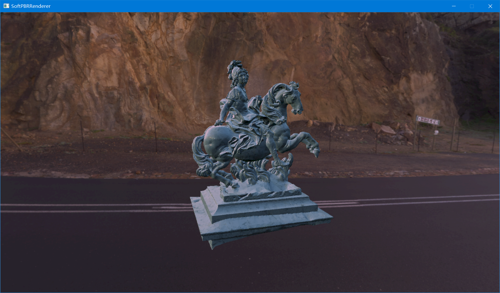
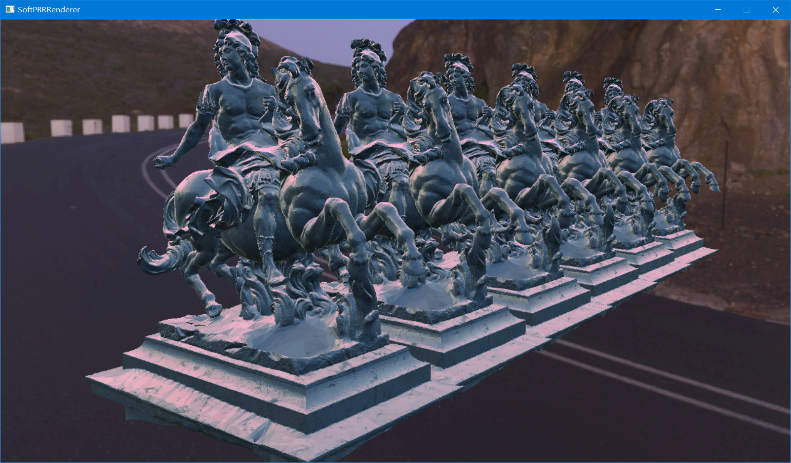
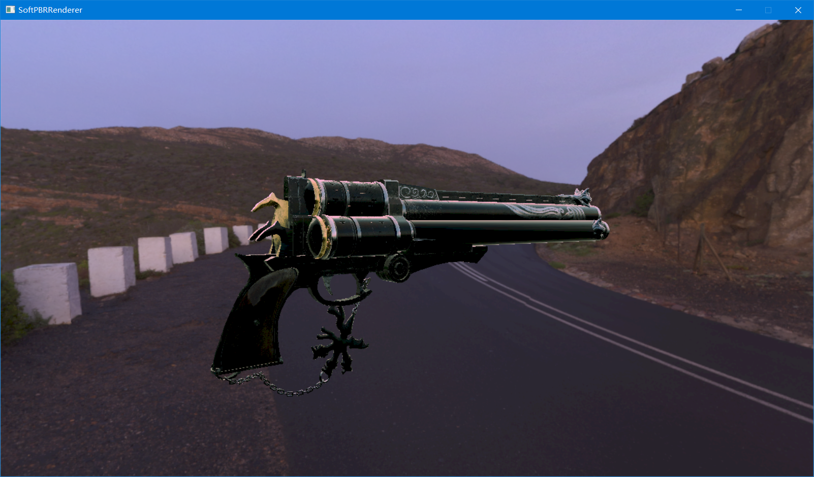
day
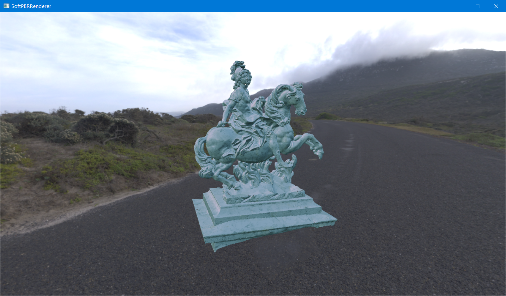
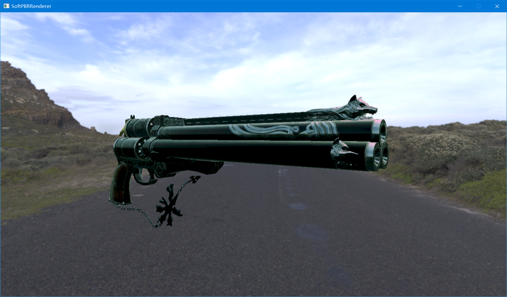
### Direct Lighting Without Tone Mapping
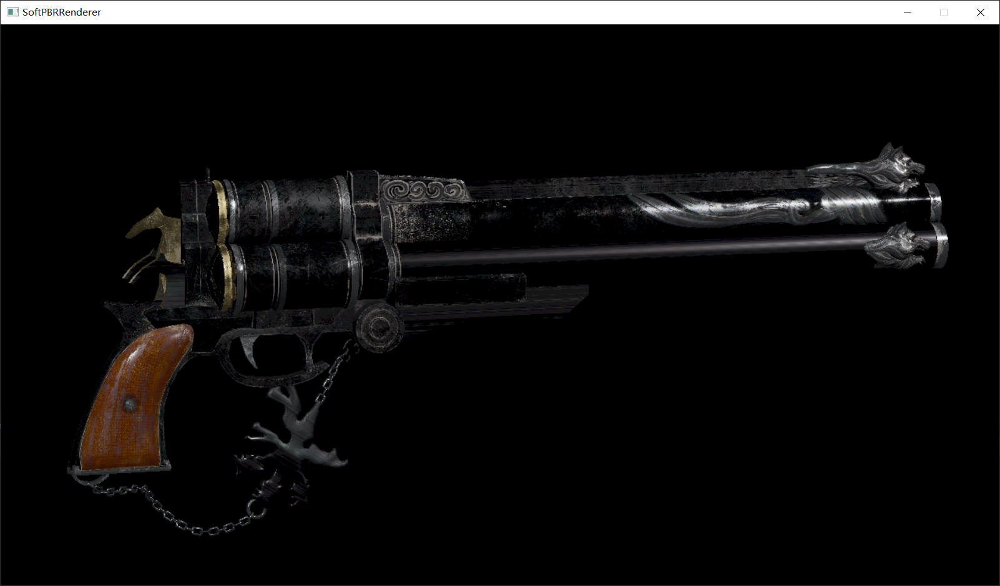

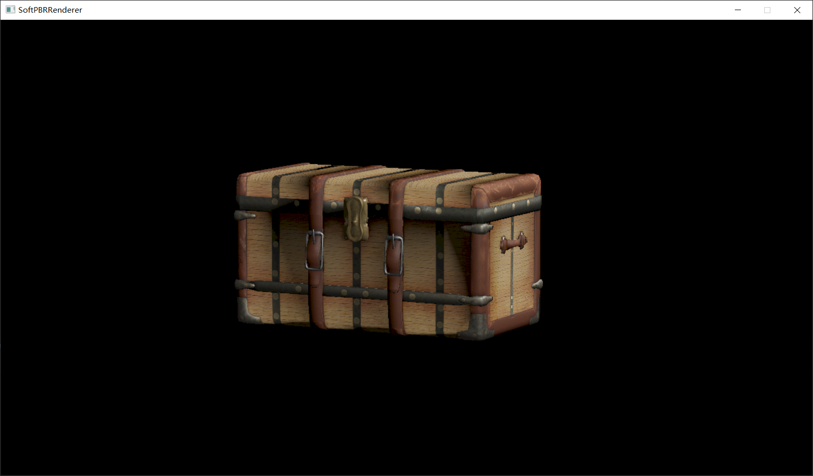

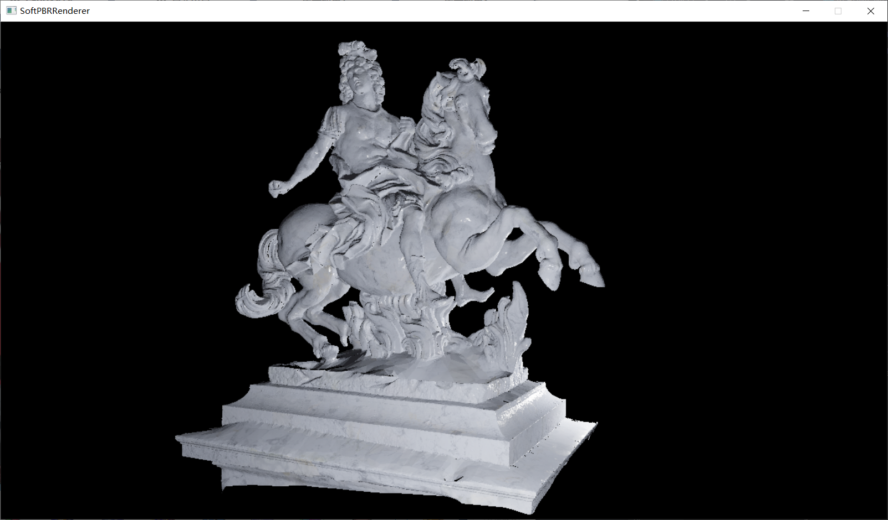

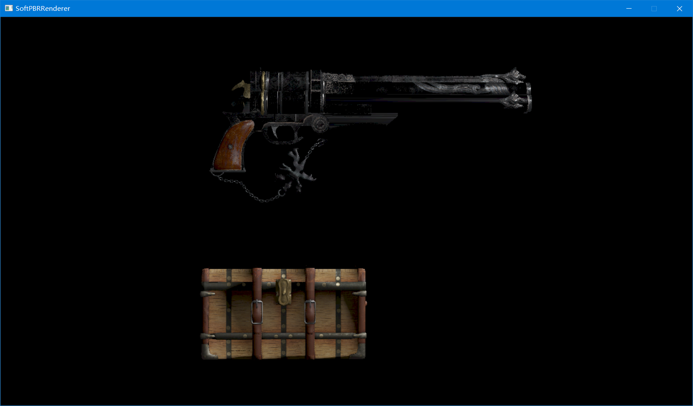

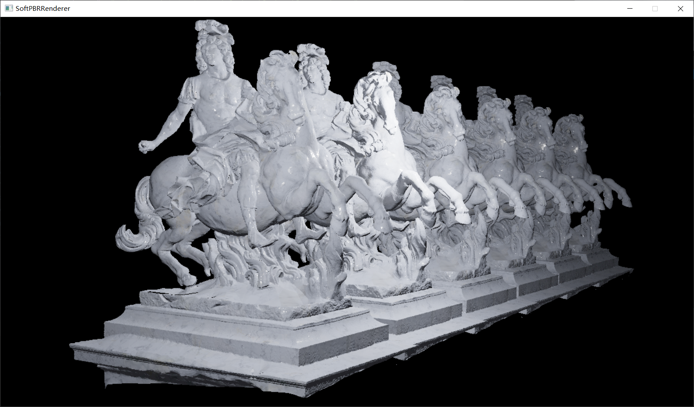

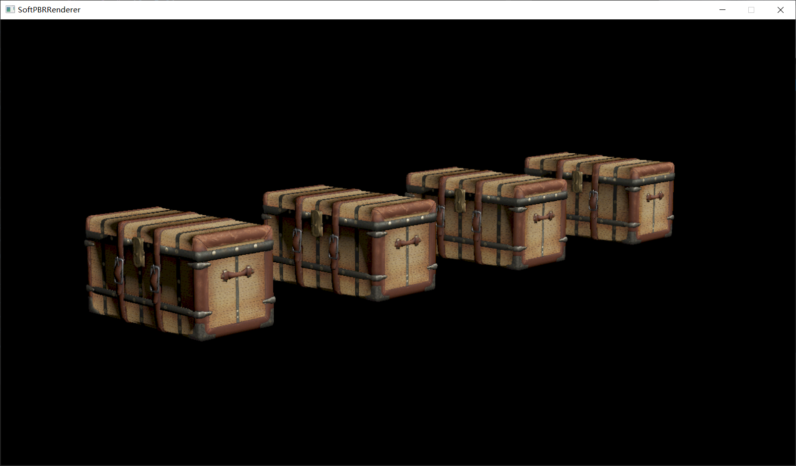
